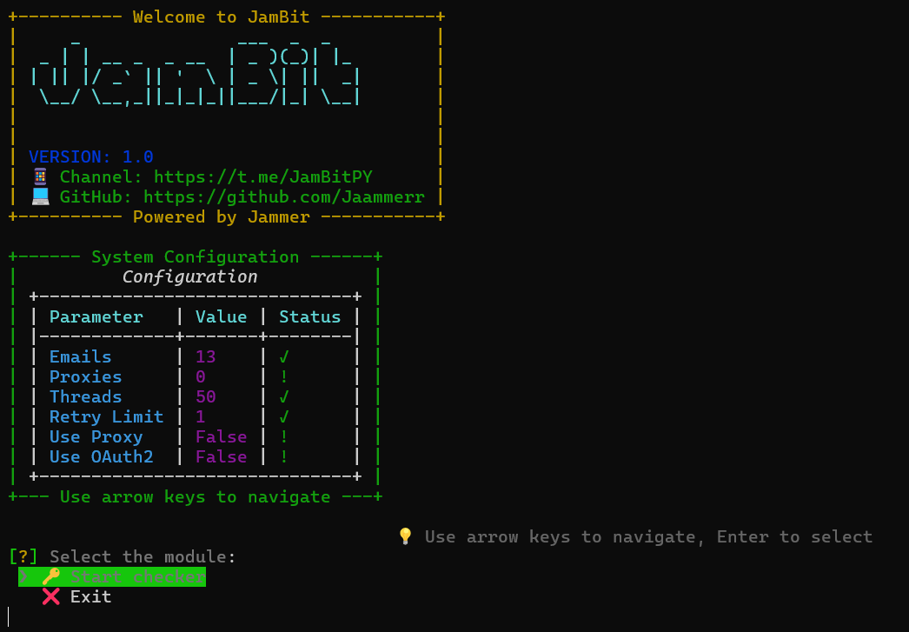

# 🌐 IMAP Emails Checker [v1.0]

<div align="center">
  
  
  <p align="center">
    <a href="https://t.me/JamBitPY">
      
    </a>
    <a href="https://t.me/JamBitChat">
      
    </a>
  </p>

<h3>Also check out my other scripts:</h3>
 <p align="center">
   <a href="https://github.com/Jaammerr/The-Dawn-Bot">
     
   </a>
   <a href="https://github.com/Jaammerr/Gradient-Network-Bot">
     
   </a>
   <a href="https://github.com/Jaammerr/Pipe-Network-Bot">
     
   </a>
   <a href="https://github.com/Jaammerr/MintChain-Bot">
     
   </a>
   <a href="https://github.com/Jaammerr/Sepolia-Auto-Faucet">
     
   </a>
 </p>
</div>

## 📋 Table of Contents
* [🚀 Features](#-features)
* [💻 Requirements](#-requirements)
* [🛠️ Installation](#-installation)
* [⚙️ Configuration](#-configuration)
* [📝 Input Files Structure](#-input-files-structure)
* [📊 Results](#-results)
* [🚀 Usage](#-usage)

## 🚀 Features
- 🔒 oAuth2/IMAP support
- 🌐 Full proxy support (HTTP/SOCKS5)
- ⚡ Multi-threaded operations
- 📊 Comprehensive account results

## 💻 Requirements

- Python 3.10-3.11
- Stable internet connection
- Working proxies (HTTP/SOCKS5) (optional)
- Email accounts

## 🛠️ Installation

1. **Clone the Repository**
   ```bash
   git clone [repository URL]
   ```

2. **Set Up Virtual Environment**
   ```bash
   python -m venv venv
   source venv/Scripts/activate  # Windows
   source venv/bin/activate      # Unix/MacOS
   ```

3. **Install Dependencies**
   ```bash
   pip install -r requirements.txt
   ```

## ⚙️ Configuration

### 📁 settings.yaml

```yaml
threads: 50     # Number of concurrent threads to run (minimum: 1)
retry_limit: 1  # Number of times to retry on failure (minimum: 1) - for example if proxy fails to connect to the server or email fails to login etc.

use_oauth: false   # Use OAuth2 (most used for outlook/hotmail) (true/false)
use_proxy: false    # Use proxy while checking emails (true/false)


# Email Provider IMAP Settings
# --------------------------
imap_settings:
  # Common email providers and their IMAP servers
  gmail.com: imap.gmail.com          # Google
  yahoo.com: imap.mail.yahoo.com     # Yahoo
  mail.ru: imap.mail.ru              # Mail.ru
  rambler.ru: imap.rambler.ru        # Rambler
  gmx.com: imap.gmx.com              # GMX
  gmx.net: imap.gmx.net             # GMX Germany
  gmx.de: imap.gmx.net              # GMX Germany (alternate domain)
  mesiosemail.ru: imap.firstmail.ltd # FirstMail
  superasemail.ru: imap.firstmail.ltd # FirstMail
  outlook.com: imap-mail.outlook.com # Outlook.com
  hotmail.com: imap-mail.outlook.com # Hotmail

  # you can add more email providers here like:
    # domain.com: imap.domain.com
    # domain2.com: imap.domain2.com
```

## 📝 Input Files Structure

### 📁 accounts.txt

**Standard Format**
```plaintext
email:password
email:password

# OR
email|password
email|password

# Extended format (additional data will be ignored)
email:password:extra_data1:extra_data2
email|password|extra_data1|extra_data2
```


**OAuth2 Format**
```plaintext
email:client_id:refresh_token
email|client_id|refresh_token
```

###


### 📁 data/proxies.txt
```
http://user:pass@ip:port
socks5://user:pass@ip:port
http://ip:port:user:pass
socks5://ip:port:user:pass
http://user:pass:ip:port
socks5://user:pass:ip:port
```


## 📊 Results

The checker creates organized result files in the following structure:

```plaintext
📁 results/
  ├── 📄 connection_error.txt  # Failed server connections (proxy issues)
  ├── 📄 invalid_credentials.txt  # Failed logins (incorrect credentials)
  └── 📄 success.txt  # Successfully verified accounts
  ```

**Result Types:**

1. connection_error.txt: Contains accounts that failed to connect (usually due to proxy issues)

2. invalid_credentials.txt: Lists accounts with incorrect login credentials

3. success.txt: Records all successfully verified accounts


## 🚀 Usage


1. Configure your settings in settings.yaml
2. Add your accounts to accounts.txt
3. If using proxies, add them to proxies.txt
4. Run the checker:
   ```bash
   python run.py
   ```
